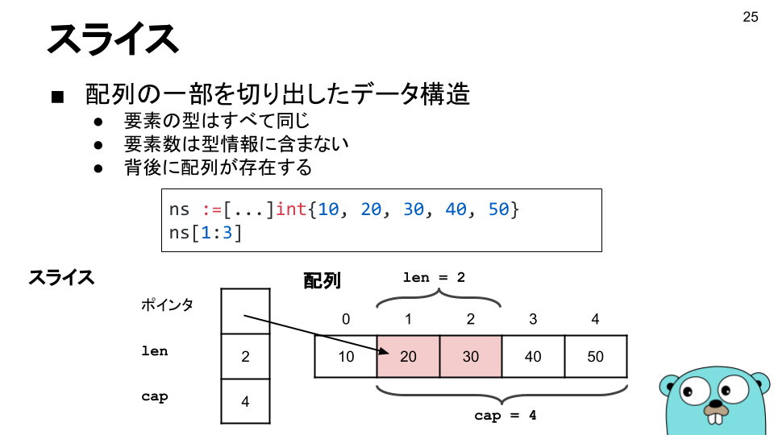
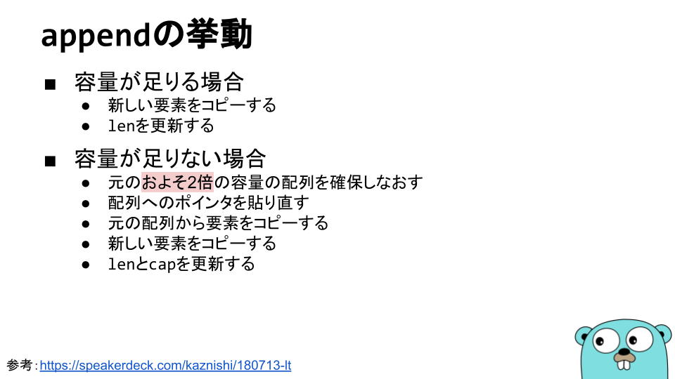
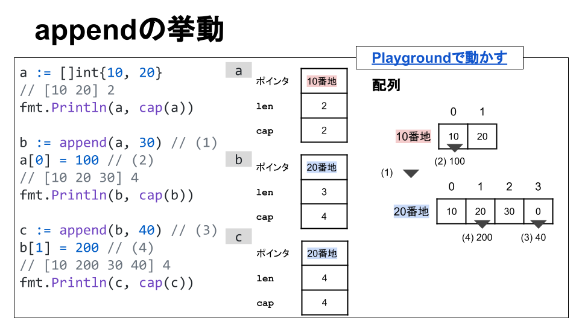
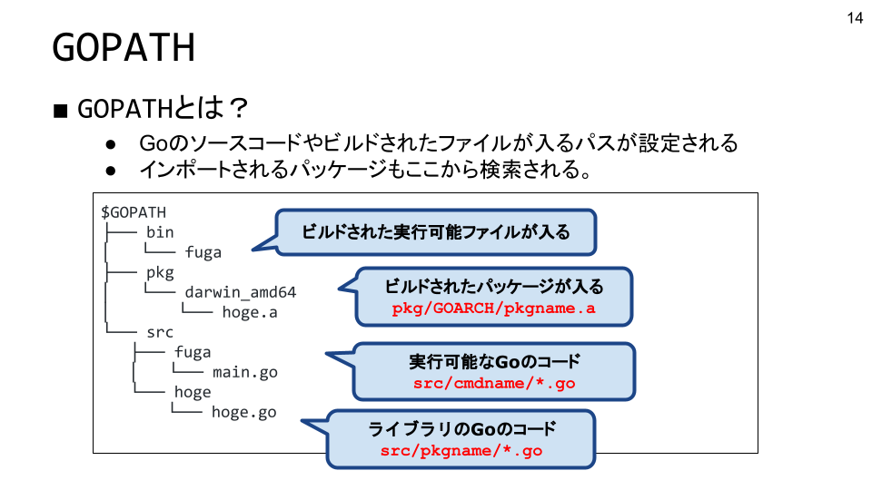

# メモ：プログラミング言語 Go 完全入門 <!-- omit in toc -->

スライドの写経、Go に関することなどのメモ書き

- [1. Go に触れる](#1-go-に触れる)
  - [Go とは](#go-とは)
  - [Go が開発された背景](#go-が開発された背景)
  - [Go の特徴：概要](#go-の特徴概要)
    - [強力でシンプルな言語設計と文法](#強力でシンプルな言語設計と文法)
    - [並行プログラミング](#並行プログラミング)
    - [豊富な標準ライブラリ](#豊富な標準ライブラリ)
    - [周辺ツールの充実](#周辺ツールの充実)
    - [シングルバイナリ・クロスコンパイル](#シングルバイナリクロスコンパイル)
  - [Go を学ぶ理由](#go-を学ぶ理由)
  - [コンパイルと実行](#コンパイルと実行)
  - [コーディングに必要なツール](#コーディングに必要なツール)
    - [コードの書式を揃える](#コードの書式を揃える)
    - [静的解析ツール](#静的解析ツール)
    - [PR レビューで静的解析ツールを使用](#pr-レビューで静的解析ツールを使用)
    - [デバッグ](#デバッグ)
- [小休止](#小休止)
- [2. 基本構文](#2-基本構文)
  - [変数](#変数)
    - [変数とは](#変数とは)
    - [変数と型](#変数と型)
    - [静的型付けの利点と Go の強い型付け](#静的型付けの利点と-go-の強い型付け)
  - [定数](#定数)
    - [定数とは](#定数とは)
    - [定数式](#定数式)
    - [右辺の省略](#右辺の省略)
    - [iota](#iota)
    - [疑問点](#疑問点)
  - [演算子](#演算子)
    - [Go の演算子](#go-の演算子)
  - [制御構文](#制御構文)
    - [Go はコンパイル時に後ろに改行があると、自動でセミコロンを付与する](#go-はコンパイル時に後ろに改行があると自動でセミコロンを付与する)
    - [if 代入文と条件文を組み合わせて書く書き方は覚えておく](#if-代入文と条件文を組み合わせて書く書き方は覚えておく)
- [3. 関数と型](#3-関数と型)
  - [3.1. 型](#31-型)
    - [コンポジット型](#コンポジット型)
      - [コンポジット型のゼロ値](#コンポジット型のゼロ値)
      - [コンポジット型：構造体](#コンポジット型構造体)
      - [コンポジット型：配列](#コンポジット型配列)
      - [補足：コンポジットリテラル](#補足コンポジットリテラル)
      - [コンポジット型：スライス](#コンポジット型スライス)
        - [スライスの作成](#スライスの作成)
        - [append の挙動](#append-の挙動)
      - [コンポジット型：マップ](#コンポジット型マップ)
    - [ユーザ定義型、型エイリアス](#ユーザ定義型型エイリアス)
  - [3.2. 関数](#32-関数)
    - [値のコピー](#値のコピー)
    - [ポインタ](#ポインタ)
  - [3.3. メソッド](#33-メソッド)
    - [基本](#基本)
    - [レシーバに使用できる型](#レシーバに使用できる型)
    - [メソッド値](#メソッド値)
    - [メソッド式](#メソッド式)
    - [レシーバがポインタのときの注意すべき挙動](#レシーバがポインタのときの注意すべき挙動)
- [4. パッケージ](#4-パッケージ)
  - [4.1. パッケージ](#41-パッケージ)
    - [Go のプログラムの構成要素](#go-のプログラムの構成要素)
    - [パッケージの種類](#パッケージの種類)
    - [補足：サードパーティパッケージの選び方](#補足サードパーティパッケージの選び方)
    - [パッケージのインポート](#パッケージのインポート)
    - [パッケージ名のエイリアス](#パッケージ名のエイリアス)
    - [パッケージ外へのエクスポート](#パッケージ外へのエクスポート)
    - [GOPATH](#gopath)
  - [4.2. パッケージ変数とスコープ](#42-パッケージ変数とスコープ)
  - [4.3. パッケージの初期化](#43-パッケージの初期化)
  - [4.4. ライブラリのバージョン管理](#44-ライブラリのバージョン管理)
- [5. コマンドラインツール](#5-コマンドラインツール)
- [6. 抽象化](#6-抽象化)
- [7. エラー処理](#7-エラー処理)
- [8. テストとテスタビリティ](#8-テストとテスタビリティ)
- [9. ゴールーチンとチャネル](#9-ゴールーチンとチャネル)
- [10. HTTP サーバとクライアント](#10-http-サーバとクライアント)
- [11. データベース](#11-データベース)
- [12. テキスト処理](#12-テキスト処理)
- [13. リフレクション](#13-リフレクション)
- [13. 静的解析とコード生成](#13-静的解析とコード生成)
- [14. ジェネリクス（型パラメタ）](#14-ジェネリクス型パラメタ)
- [15. パフォーマンスチューニング](#15-パフォーマンスチューニング)
- [その他のメモ](#その他のメモ)
  - [自作パッケージの import](#自作パッケージの-import)
  - [ユニットテストの書き方](#ユニットテストの書き方)
- [Q&A](#qa)

## 1. Go に触れる

### Go とは

- Google が開発したプログラミング言語
- 特徴
  - 強力でシンプルな言語設計と文法
  - 並行プログラミング
  - 豊富な標準ライブラリ群
  - 周辺ツールの充実
  - シングルバイナリ・クロスコンパイル（OS、アーキテクチャを指定してコンパイルできる）

### Go が開発された背景

- **Google 内の課題を解決するために開発された**
  - 開発速度の低下
    - 超巨大なコードベース
    - 複雑な依存関係
  - マルチコア時代のシステム言語
    - 並行処理とガベージコレクタを同時に採用
  - 軽量プログラミング言語（LL、Light weight Language）の盛り上がり
    - 静的型付け言語だとコンパイル時にエラーが発見できる
    - 動的型付け言語だと書きやすい
    - 静的 / 動的型付け言語のいいとこどりをした書きやすい静的型付け言語が Go
  - 静的解析がしやすい
    - 言語設計レベルで静的解析しやすい言語を目指した

### Go の特徴：概要

- 強力でシンプルな言語設計と文法
- 並行プログラミング
- 豊富な標準ライブラリ群
- 周辺ツールの充実
- シングルバイナリ・クロスコンパイル（OS、アーキテクチャを指定してコンパイルできる）

#### 強力でシンプルな言語設計と文法

- 強力でシンプルな言語設計と文法
  - スクリプト言語の書きやすさ
    - 冗長な記述は必要ない
  - 型のある言語の厳密さ
    - 曖昧な記述ができない
  - 考えられたシンプルさ
    - 機能を増やすことで言語を拡張していくことはしない
    - 例えば、他の言語の良さそうな機能を Go にどんどん取り入れていくという文化ではない。できる限り言語設計はシンプルに保つ。

Go に入って Go に従え = 言語の思想を理解するのが大事

#### 並行プログラミング

- ゴールーチン
  - **軽量なスレッド**に近いもの（スレッドとは何が違うの？）
  - `go` キーワードを付けて関数呼び出し

```go
// 関数 f を別のゴールーチンで呼び出す
go f()
```

- チャネル
  - ゴールーチン間のデータのやり取り（スレッド間のデータのやり取りと同じ要領）
  - 安全にデータをやり取りできる

#### 豊富な標準ライブラリ

- 標準ライブラリ一覧
  - https://pkg.go.dev/std

| 標準ライブラリ名  | 内容、機能             |
| ----------------- | ---------------------- |
| fmt               | 書式、出力に関する処理 |
| net/http          | HTTP サーバなど        |
| archive, compress | zip や gzip など       |
| encoding          | JSON、XML、CSV など    |
| html/template     | HTML テンプレート      |
| os, path/filepath | ファイル操作など       |

#### 周辺ツールの充実

- `go tool` として標準 / 準標準で提供
- サードパーティ製のツールも充実
- IDE によらない独立したツールとして提供

| コマンド             | 内容、機能                            |
| -------------------- | ------------------------------------- |
| `go build`           | ビルドを行うコマンド                  |
| `go test`            | `xxxx_test.go`                        |
| `go doc`, `godoc`    | ドキュメント生成                      |
| `gofmt`, `goimports` | コードフォーマッタ                    |
| `go vet`             | コードチェッカー                      |
| `gopls`              | Language Server Protocol（LSP）の実装 |

#### シングルバイナリ・クロスコンパイル

- シングルバイナリになる
  - コンパイルするとデフォルトで単一の実行可能ファイルが生成される（C / C++ などと同じ）
  - 動作環境を特別に用意しなくてもよい（バイナリなので、インタプリタを必要とする言語と異なり、動作させる際に言語処理系が必要ない）
- クロスコンパイルできる
  - 開発環境とは違う OS やアーキテクチャ（CPU）向けのバイナリが作れる
  - 環境変数の `GOOS`（OS を指定）と `GOARCH`（アーキテクチャを指定）を指定する

```sh
# Windows(32 ビット)向けにコンパイル
$ GOOS=windows GOARCH=386 go build

# Linux(64 ビット)向けにコンパイル
$ GOOS=linux GOARCH=amd64 go build
```

`go build` は Go のソースコードをビルドするコマンド

### Go を学ぶ理由

- 多くのプロダクトで採用
  - https://github.com/golang/go/wiki/GoUsers#japan
- チーム開発に向いている
  - 静的型付け
  - 文法がシンプル
- パフォーマンスが良い
  - ゴールーチンとチャネル
  - バイナリになる（インタプリタを必要とする言語と異なり、動作させる際に言語処理系が必要ない）

### コンパイルと実行

- `go build` コマンド
  - コンパイルして実行可能ファイル（バイナリファイル）を生成

```sh
go build main.go
go build .
go build pkg_name
```

- `go run` コマンド
  - コンパイルから実行まで行う

```sh
go run main.go
go run .
go run pkg_name
```

### コーディングに必要なツール

#### コードの書式を揃える

- gofmt
  - 読み方:ごーふむと
  - 標準のフォーマッタ
  - **絶対に使う**
  - `-s` オプションで冗長な書き方をシンプルにできる
- goimports
  - `import` 文を追加 / 削除してくれる
  - 未使用パッケージ `import` コンパイルエラーなのでで必須
  - フォーマットもかける
  - `-s` オプションがない

#### 静的解析ツール

| ツール名      | 機能                                                               |
| ------------- | ------------------------------------------------------------------ |
| go vet        | バグと言えるレベルの誤りを検出（これで検出されるのはだいたいバグ） |
| golint        | （非推奨）Go らしくないコードを検出                                |
| errcheck      | エラー処理のミスを検出                                             |
| staticcheck   | サードパーティ製の静的解析ツール                                   |
| GolangCI-Lint | サードパーティ製の Linter Runner                                   |
| gosec         | セキュリティチェック                                               |

#### PR レビューで静的解析ツールを使用

- reviewdog
  - リポジトリ：https://github.com/reviewdog/reviewdog
  - レビュー時に自動で静的解析ツールを実行する
  - 機械的にチェックできることは機械にやらせる
  - 人間だと忘れたり、心苦しかったりしてチェックが漏れる
  - 設定ファイルを書けば reviewdog が勝手に PR にコメントをくれる

#### デバッグ

- GDB
  - リポジトリ：https://golang.org/doc/gdb
  - 有名な古き良きデバッガ
  - Go 自体にカスタマイズされてるわけではない。（Go 開発では使わない？）
- Delve
  - リポジトリ：https://github.com/derekparker/delve
  - Go 専用のデバッガでよく使われる
  - ゴールーチンやチャネルにも対応
- panic デバッグ
  - `panic` 関数を使ってデバッグ
  - スタックトレースが出るので便利
- print デバッグ

## 小休止

Go を Homebrew を用いてインストールし、VSCode の Go 拡張を入れてコードを書き始めようとしたら、Go 拡張に必要なツールが無くて怒られた。

以下、必要なツールのインストールコマンド。

```sh
# "gopls"（Language Server Protocol）
go get -v golang.org/x/tools/gopls

# "goimports"
go get -v golang.org/x/tools/cmd/goimports

# "go-outline"
go get -v github.com/ramya-rao-a/go-outline

# "gopkgs"
go get -v github.com/uudashr/gopkgs/v2/cmd/gopkgs
```

## 2. 基本構文

1. 変数
2. 定数
3. 演算子
4. 制御構文

### 変数

#### 変数とは

- 変数 variable
  - 識別子、それに関連付けられたメモリアドレス、型から構成されるもので、プログラミング言語の仕様。プログラム実行中に一時的に値を保存（状態を保存）しておくための仕組みとして利用される。例えば、一時的な計算結果の保持などに利用される。
  - メモリ上にある値なので、マシンが止まると消える（揮発性）
  - プログラムの実行が終わると消える
  - 変数の内容を結果として残したい場合、ファイルなど外部記憶装置上で管理される領域や出力装置（プリンタなど）経由で出力する必要がある

#### 変数と型

- 型 type
  - どういう種類の値かを表すもの
  - 整数、浮動小数点数、真偽値、文字列 など
  - 自分で作ることも可能（ユーザ定義型）
  - 変数の型：どういう種類の値が入るのかを表したもの
- 型の扱いによるプログラミング言語の分類
  - 動的型付け言語 dynamically typed language
    - **プログラム実行時に「値の型」を検証する**（型が無いわけではないよ！）
    - 変数に型がなく、なんでも代入できる
  - 静的型付け言語 statically typed language
    - **コンパイル時に「変数の型」を検証する**
    - 変数に型がある、型が違うと代入できない

#### 静的型付けの利点と Go の強い型付け

型の一番の恩恵は、「プログラムの実装中には見つけづらい型の不一致によるエラーを、実行前にコンパイラにより検出でき、それにより生産性が上がる」ことである。動的型付け言語の場合、型の不一致によるエラーには実装中に気づかず、実行してから実行時エラーとして気付くということがしばしば見られる。

- **実行前に型の不一致を検出できる**
  - コンパイルが通れば型の不一致が起きない
  - 型の不一致によるバグは見つけづらいので、これをプログラム実行前に行えるのは効率的
- **曖昧なものはエラーになる**
  - 暗黙の型変換がない
  - 1 + "2" => "12"（JavaScript）
  - 浮動小数点数と整数の演算など見つけづらいバグが起きにくい
- **型推論がある**
  - 明示的に型を書く必要がない場合が多い

### 定数

- https://blog.golang.org/constants

#### 定数とは

- 定数 constant
  - 値の変わらないもの
  - コンパイル時から値が変わらないもの
  - リテラルで記述されることが多い

#### 定数式

- 定数式
  - 定数のみからなる演算式。コンパイル時に計算される。

例えば以下のようなコード。

```go
100 + 200
1 << 2
"Hello, " + "世界"
!(10 == 20)
```

#### 右辺の省略

- 右辺の省略

```go
func main()  {
    const (
        a = 1 + 2  // 3（以下、全て 3 になる）
        b          // 3
        c          // 3
    )

    fmt.Println(a, b, c)  // 全て 3 が出力される
}
```

#### iota

- iota
  - 連続した定数を作るための仕組み
  - グループ化された名前付き定数の定義で使われる
  - 0 から始まり 1 ずつ加算される値として扱われる

```go
func main()  {
    const (
        a = iota  // + 0
        b         // + 1
    )
    const (
        c = 1 << iota  // 1 << 0 = 1 (0001 --- 0 桁左シフト --> 0001)
        d              // 1 << 1 = 2 (0001 --- 1 桁左シフト --> 0010)
        e              // 1 << 2 = 4 (0001 --- 2 桁左シフト --> 0100)
    )

    fmt.Println(a, b, c, d, e)  // 0, 1, 1, 2, 4
}
```

#### 疑問点

- なぜ「型を持たない定数」という言語仕様を意図して作ったのか？
  - どういうメリットが有るのか？定数にも確実に型付けが行われるような仕様にした方が良いのではないか？

### 演算子

#### Go の演算子

- 演算子一覧
  - https://golang.org/ref/spec#Operators
- 演算子
  - 算術演算
  - 代入演算
  - ビット演算
  - 論理演算
  - 比較演算
  - アドレス演算
    - `&`：変数のポインタ（アドレス）を取得する演算子
      - e.g. 変数のポインタを取得 `&a`
    - `*`：ポインタ（アドレス）が指す値を取得する演算子
      - e.g. 変数のポインタから値を取得 `*(&a)`
  - チャネル演算
    - goroutine を使用するときに使用する演算子。チャネルへの送受信を行う演算子。
      - e.g. `ch <- 100`、`<- ch`

### 制御構文

- if、if-else
  - Go はコンパイル時に後ろに改行があると、自動でセミコロンを付与する
    - ※ 改行の前が `{` などの文字だと差し込まない
  - if 代入文と条件文を組み合わせて書く書き方は覚えておく
- for
  - `for 初期値; 継続条件; 更新文`
  - while 文はない
  - 継続条件のみを書くと while 文っぽくなる
  - for 文に何も条件を書かなければ無限ループになる
- break
- goto
- switch
  - 一般的な switch 文で必要な各 case ごとの `break` は必要ない
  - case に式が使える
  - case をまたぎたい場合、`fallthrough` を使う（また使う時に調べれば OK）

#### Go はコンパイル時に後ろに改行があると、自動でセミコロンを付与する

コンパイラの仕様を一応頭に入れておく。コンパイルエラーになる、ならない書き方を紹介。

```go
// コンパイルエラーにならない
// () はいらない
if a == 0 {

}

// コンパイルエラーになる
// コンパイル時に "if a == 0" の後ろにセミコロンが入ってしまい、コンパイルエラーになる。
if a == 0
{

}

// コンパイルエラーになる
// () はつけない
if (a == 0) fmt.Println(a)
```

#### if 代入文と条件文を組み合わせて書く書き方は覚えておく

変数 `a` を、if 文の条件文を書く前に代入文で宣言している。この場合、変数 `a` は if、else のブロック内で使える変数となる。

```go
if a := f(); a > 0 {
    fmt.Println(a)
} else {
    fmt.Println(2 * a)
}
```

## 3. 関数と型

スライド：[3. 関数と型](https://docs.google.com/presentation/d/1DtWB-8FcnNb9asxSpIaOLYbAEc9OjBAwMLNxKnPA8pc/edit#slide=id.g4cbe4d134e_0_0)

3.1. 型
3.2. 関数
3.3. メソッド

### 3.1. 型

- 型 type
  - どういう種類の値かを表すもの
  - 整数、浮動小数点数、真偽値、文字列 など
  - 自分で作ることも可能（ユーザ定義型）
  - 変数の型：どういう種類の値が入るのかを表したもの
- 型の扱いによるプログラミング言語の分類
  - 動的型付け言語 dynamically typed language
    - **プログラム実行時に値の型を検証する**（型が無いわけではないよ！）
    - 変数に型がなく、なんでも代入できる
  - 静的型付け言語 statically typed language
    - **コンパイル時に変数の型を検証する**
    - 変数に型がある、型が違うと代入できない
- 実装上の型の分類
  - 組み込み型
    - 言語に元から組み込まれている型。特に必要なパッケージの import なくコードを書くときに使える。
  - コンポジット型
  - ユーザ定義型
- 型のキャスト
  - 特定の値の型を別の型に変換すること
  - `T(v)`

```go
package main

func main() {
  var f float64 = 10
  var n int = int(f)
  println(n)
}
```

#### コンポジット型

- コンポジット型
  - 複数のデータ型が集まって 1 つのデータ型になっている。集まり方によって種類がある。
  - なぜコンポジット型が必要か？
    - 単一のデータを保持する型だけだと、大量のデータを扱う場合に非常に不便になる。

| 型の種類     | 説明                                     |
| ------------ | ---------------------------------------- |
| **構造体**   | 型の異なるデータ型の変数を集めたデータ型 |
| **配列**     | 同じ型のデータを集めて "並べた" データ型 |
| **スライス** | 配列の一部を切り出したデータ型           |
| **マップ**   | キーと値をマッピングさせたデータ型       |

- 型リテラル
  - 型の具体的な定義を書き下した型の表現方法
  - コンポジット型などを表現するために使う
  - 用途
    - 変数定義やユーザ定義型などで使用する
  - 補足
    - **リテラル = プログラム中で識別子（名前）が付与されてないもの**

##### コンポジット型のゼロ値

- Go における「ゼロ値」
  - Go の変数は定義時に必ず何かの値で初期化される。もし変数初期化時に特定の値を変数の初期値と指定しない場合、デフォルトの値で初期化される。このときの値を「ゼロ値」という。
  - コンポジット型のゼロ値はデータの表現方法によって異なる
    - 構造体や配列は要素（フィールド）が全てゼロ値の値で初期化される
    - スライスやマップは特殊で、初期化のために材料が必要になる。`make` 関数などで初期化が必要なためゼロ値は `nil` となる。

| 型の種類     | ゼロ値                           |
| ------------ | -------------------------------- |
| **構造体**   | フィールドのそれぞれの型のゼロ値 |
| **配列**     | 配列の要素の型のゼロ値           |
| **スライス** | `nil`                            |
| **マップ**   | `nil`                            |

##### コンポジット型：構造体

- 構造体
  - 型の異なるデータ型の変数を集めたデータ構造
    - 各変数は「フィールド」と呼ばれる
    - 下の例では、「構造体 `p` はフィールド `name` と `age` を持つ」という
    - フィールドの型は異なってもよい（同じ型も可）
    - フィールドの型には組み込み型以外も使える
      - コンポジット型やユーザ定義型も構造体のフィールドとして定義可能
      - 「構造体の変数をフィールドに持つ構造体」が可能。もっと入れ子になっても OK。
- 構造体を使う
  - 構造体の型リテラル
  - 構造体リテラル

##### コンポジット型：配列

- 配列
  - 同じ型のデータを集めて並べたデータ構造
    - 要素の型は全て同じ
    - Go の配列は**固定長配列**
    - 要素数が違えば別の型
      - つまり、`[5]int` と `[4]int` は配列だけど異なる型として認識される。配列の長さも型の情報に含まれる。
    - 要素数は変更できない
    - 型は型リテラルで記述することが多い
  - Go ではそんなに配列を使わない。スライスの方がよく使われる。
- 配列を使う
  - 配列の型リテラル
  - 配列リテラル

##### 補足：コンポジットリテラル

Go の文法上では、構造体リテラルと配列リテラルは同じ。「コンポジットリテラル」として言語仕様に定義されている。構造体リテラルでは、（実装上はあまりやらないけど）配列リテラルと同じくフィールド名を省略できる。

一見違うことをしているように見えているものが、文法として捉えると全く同じことをしているということがあるので、プログラミング言語を学ぶときはそういった点にも注意して学ぶと良い。**文法を覚えると、覚えることが少なくて良くなる。「文法上正しいからこれは書けるよね」という考え方になって、どのような書き方が OK か NG かが瞬時に分かるようになる。**

- コンポジットリテラル
  - [Composite literals | Go Documentation](https://golang.org/ref/spec#Composite_literals)

##### コンポジット型：スライス

- スライスの説明
  - [スライド](https://docs.google.com/presentation/d/1DtWB-8FcnNb9asxSpIaOLYbAEc9OjBAwMLNxKnPA8pc/edit#slide=id.g4cbe4d134e_0_191)
  - 動画
    - 29:48 ~ 1:10:12



（[「プログラミング言語 Go 完全入門」のスライド](https://docs.google.com/presentation/d/1DtWB-8FcnNb9asxSpIaOLYbAEc9OjBAwMLNxKnPA8pc/edit#slide=id.g4cbe4d134e_0_191)より引用）

- スライス
  - [spec: Slice types](https://golang.org/ref/spec#Slice_types)
  - 説明
    - 配列の一部を切り出したデータ構造
  - 特徴
    - 要素の型は全て同じ（配列の一部の切り出しなので当然）
    - 要素数は型情報に含まない
    - **背後に配列が存在する**
    - 初期値はゼロ値ではなく `nil`
  - スライスの型情報
    - ポインタ：スライスの最初の要素へのポインタ
    - len：スライスの長さ
    - cap：スライスの最初の要素から、背後にある配列の末尾までの要素数。要は「スライスの容量」（背後の配列が確保しているメモリ幅）

```go
ns :=[...]int{10, 20, 30, 40, 50}
s := ns[1:3] // s := []int{20, 30}
```

- （自分的な）スライスのポイント
  - 背後にある配列を意識する
  - コピーコストを意識する
    - ただし、早すぎる最適化は NG。パフォーマンスがこっちの方が良いということが自明の場合のみ。

###### スライスの作成

スライスの作成には主に以下の 3 つの方法がある。

1. 配列から作成
2. 直接スライスの宣言
3. `make` 関数を使って初期化
4. `new` 関数を使って初期化

```go
// 1
arr := [...]int{10, 20, 30, 40, 50}
sl := arr[0:3]
// start のインデックスが 0 の場合、省略可能
// sl := arr[:3]

// 2
sl := []int{10, 20, 30}

// 3
sl := make([]T, length, capacity)
sl := make([]int, 5, 5)

// 4
sl := new([5]int)[0:5]
```

###### append の挙動

- 容量が足りる場合
  - 新しい要素をコピーする
  - `len` を更新する
- 容量が足りない場合
  - 元の "およそ 2 倍" の容量の配列を確保し直す
  - 配列へのポインタを貼り直す
  - 元の配列から要素をコピーする
  - 新しい要素をコピーする
  - `len`、`cap` を更新する



（[引用元](https://docs.google.com/presentation/d/1DtWB-8FcnNb9asxSpIaOLYbAEc9OjBAwMLNxKnPA8pc/edit#slide=id.g4cbe4d134e_0_837)）



（[引用元](https://docs.google.com/presentation/d/1DtWB-8FcnNb9asxSpIaOLYbAEc9OjBAwMLNxKnPA8pc/edit#slide=id.g7dc1d6af71_0_121)）

##### コンポジット型：マップ

- 初期化時の値（ゼロ値）は nil
  - `make` で作るものはだいたいゼロ値は `nil`
    - マップ、スライス、チャネル
- key の値は `==` で比較可能なもの
  - 比較可能：int、string、ポインタ、配列、構造体、...
  - 比較不可能：スライス、スライスを要素に持つ配列や構造体
    - スライスは `nil` としか比較できない。スライスが等しいか調べたいなら for 文を使うしか無い。
- ゼロ値が便利

#### ユーザ定義型、型エイリアス

- ユーザ定義型
  - 説明
    - `type` で名前を付けて新しい型として定義する
    - 基底型とユーザ定義型の相互キャストが可能
    - 型なし定数から明示的なキャストは不要
      - Go に元々備わっているデフォルトの型からユーザ定義型へキャストできる
  - フォーマット
    - `type 型名 基底型`
- 型エイリアス（Go 1.9 以上）
  - 説明
    - 特定の型に別の名前を付ける
    - ユーザ定義型は別の型として定義されるが、型エイリアスはあくまでも "エイリアス" であり、中身は全く同じ型である。
    - リファクタリングとかテストで使うくらい？あんまり使わないらしい？
  - フォーマット
    - `type 型名 = 基底型`

ユーザ定義型

```go
// type 型名 基底型

// 組み込み型も基にする
type MyInt int
type MyString string
type IntPtr *int
type StructPtr *struct{
    x int
    y string
}

// 他のパッケージの型を基にする
type MyWriter io.Writer

// 型リテラルを基にする
type Person struct {
    Name        string
    Age         int
    Affiliation string
}

// 相互キャスト
type MyInt int
var n int = 100
m := MyInt(n)
n = int(m)

// 型なし定数か明示的なキャストは不要
// デフォルトの型からユーザ定義型へキャストできる場合
d := 10 * time.Second // <- time.Duration 型
```

型エイリアス

```go
type Applicant = http.Client

func main() {
    // Applicant か型は基になった型名を出力する
    // あくまでもエイリアス
    fmt.Printf("%T, %T\n", http.Client{}, Applicant{})
}
```

### 3.2. 関数

- 関数
  - 一連の処理をまとめたもの
    - 引数で受け取った値を基に処理を行い、戻り地として結果を返す機能
      - **必ずしも引数や戻り値がなくても良い**
    - 引数：関数の入力となるもの。`f(x)` ば場合 `x`
    - 戻り値（返り値）：関数の出力となるもの
  - 関数の種類
    - 組み込み関数
      - 言語の機能として組み込まれている関数
    - ユーザ定義関数
      - ユーザて定義した関数
- クロージャと良くあるバグ
  - 定義じ実行のタイミングを気をつける
    - 関数外の変数（自由変数）さ参照している場合、実行のタイミングでは値が変わっていか可能性がある
- ポイント
  - Go の関数は値渡し。渡した時にコピーされる。
  - 参照渡し（的なこと）をしたい場合、ポインタを渡す（ポインタ自体はコピーされる）。

#### 値のコピー

- 代入ではコピーが発生する
  - 代入元（コピー元）と同じ値がコピーされる
  - コピーのため、代入後（前）の変数に変更を加えても代入前（後）の変数には影響を与えない
  - 関数の引数も戻り値でも同様のことが起きる
    - Go の関数は値渡し。参照渡しをしたいなら関数にポインタを渡す。

#### ポインタ

- ポインタ
  - 説明
    - 変数の格納先を表す値
    - 値で渡される型の値に対して破壊的な操作を加える際に利用する
      - 破壊的な操作 = 関数を出てもその影響が残る
- 内部でポインタが使われているデータ型
  - コンポジット型の一部
    - スライス
    - マップ
    - チャネル
  - これらの型はポインタを用いる必要がない場合が多い

### 3.3. メソッド

#### 基本

- メソッド
  - レシーバと紐付けられた関数
    - データとそれに対すそ操作を紐付けるために用いる
    - ドットでメソッドにアクセスする
- レシーバ
  - メソッドに関連付けられた変数
    - メソッド呼び出し時に通常引数と同じような扱いになる
      - コピーが発生する（ポインタでもコピーはされるよ！）
      - **第 0 引数と考えると分かりやすい**
    - レシーバにポインタを用いることで、レシーバへの変更を呼び出し元に伝えることができる
      - レシーバがポインタの場合でもドットでアクセスできる（シンタックスシュガー）
- 注意
  - `*T` 型は、`T` のメソッドも自身のメソッドとして扱われる
    - `*T` は自分自身はメソッドを持ってなくても、`T` のメソッドを使える
    - 逆は成り立たず、`T` は `*T` のメソッドをリテラルからは直接使えない。変数からは使える。
      - 変数から使えるのは、既にメモリ上に確保されていてポインタが存在する）。変数を取るとポインタが取れるようになる。**結局 `*T` のメソッドを呼び出せるかどうかはポインタが取れるかどうかで決まる！！**
      - ↓ の例で`(T{}).g()`ははだめ。`(&T{}).g()`と `(*&T{}).g()` は OK。後者は一旦ポインタを介しているため OK。

```go
type T struct {}
func (t T) f() {
    fmt.Println("f() executed.")
}
func (t *T) g() {
    fmt.Println("g() executed.")
}

// `*T` 型は、`T` のメソッドも自身のメソッドとして扱われる
func ex2() {
    // シンタックスシュガー
    var t T
    (&t).g()
    t.g() // シンタックスシュガー
    // 型 T があたかも g をメソッドとして持っているかのように
    // 扱えるシンタックスシュガー

    // f() はレシーバが T 型
    (T{}).f() // T
    (&T{}).f() // *T
    (*&T{}).f() // T

    // g() はレシーバが *T 型
    (T{}).g() // T // error: コンパイルエラー
    (&T{}).g() // *T
    (*&T{}).g() // T // 一度ポインタを通すと呼べるようになる
}
```

#### レシーバに使用できる型

[参考スライド](https://docs.google.com/presentation/d/1DtWB-8FcnNb9asxSpIaOLYbAEc9OjBAwMLNxKnPA8pc/edit#slide=id.g4cbe4d134e_0_400)
参考記事：[メソッれレシーバについてのまとめ](https://qiita.com/tenntenn/items/49bf8b5cc69c2fcfb627)

- レシーバに使用できる型
  - `type` で定義した型
    - ユーザ定義の型をレシーバに出来る（違うけどイメージとしては Python で自作クラス作ってメソッド作るみたいなイメージ）
    - そもそも同じパッケージ内じゃないとだめだよ
  - ポインタ型
    - レシーバへ変更を与えたい場合
    - レシーバのコピーコストが気になる場合
  - 内部にポインタを持つ型
    - マップやスライスやチャネルもレシーバにできる

#### メソッド値

- メソッドの値として扱える
  - レシーバは束縛された状態（評価された時点でのレシーバのにに束縛される）

```go
type Hex int
func (h Hex) String() string {
  return fmt.Sprintf("%x", int(h))
}

func main() {
  var hex Hex = 100
  var hp *Hex = &hex

  f := hex.String
  fmt.Println(f()) // 64
}
```

#### メソッド式

- レシーバを第 1 引数とした関数になる
  - Go では、型に紐付いたメソッドを直接呼び出すこともできる。今までは、型に紐付けたメソッドを変数から呼び出していたため、その変数自体がレシーバとなってメソッドを呼び出していたが、型から直接メソッドを呼び出す場合はそもそもレシーバが存在しないため、引数としてレシーバの代わりになる値を渡す必要がある。

```go
type Hex int
func (h Hex) String() string {
  return fmt.Sprintf("%x", int(h))
}

func main() {
  var hex Hex = 100
  var hp *Hex = &hex

  f := Hex.String // 型から呼び出す
  fmt.Println(f(hex)) // 64
}
```

#### レシーバがポインタのときの注意すべき挙動

- ツイート
  - https://twitter.com/inukirom/status/1065520332411363328

> メソッドのレシーバーがポインタのときには値ではなくポインタがバインドされるのでこういう挙動になるという話です。for ループじゃなくても変数を使い回していると同じ事がおきますが、実際にこういうことが発生するのは for を使っているときが多いと思います。

```go
package main

import "fmt"

type Foo struct {
    Name string
}

func (f *Foo) PrintName() {
    fmt.Printf("%p ", f)
    fmt.Println(f.Name)
}

func main() {
    foos := []Foo{{"aaa"}, {"bbb"}, {"ccc"}}

    var callbacks []func()
    for _, f := range foos {
      fmt.Printf("%+v\n", f)
      fmt.Printf("%p %p\n", &f, f.PrintName)
      callbacks = append(callbacks, f.PrintName)
    }

    fmt.Printf("----------\n")

    for _, cb := range callbacks {
      cb()
    }
}
```

- 課題コード
  - https://play.golang.org/p/pRqsmBe-Ovu
  - 自分が引っかかったポイント
    - `f.PrintName` を `append` したとき、f の値が束縛されると思ったが、実際には `PrintName` は型 `Foo`のポインタ（`*Foo`）に紐付いたメソッドであるため、ここでの `f.PrintName` は `(&f).PrintName` のシンタックスシュガーである。
- 解説コード
  - https://play.golang.org/p/JH1gdtDN4Nw

## 4. パッケージ

- [Gopher 道場 - 4. パッケージ](https://docs.google.com/presentation/d/1AIvamp68f8cOyJBnKtTr0t-aRNrg95OyyWUgFG9ahlA/edit#slide=id.g4f1426e3ae_0_0)

### 4.1. パッケージ

#### Go のプログラムの構成要素

- **パッケージ**
  - 関数や定数、型を意味のある単位でまとめたもの
  - Go のプログラムはパッケージを組み合わせることで実現される
- パッケージの中身
  - 型
  - 関数
  - 変数
  - 定数

#### パッケージの種類

パッケージの種類は以下の 3 つ

- main パッケージ
  - `main` 関数が存在するパッケージ
  - プログラムの起点（エントリーポイント）となるパッケージ
    - プログラム実行時には `main` 関数の最初の行から実行される
  - 実行可能な Go のプログラムの場合には必ず存在する
- 標準パッケージ
  - Go が最初から用意しているパッケージ
  - 100 以上のパッケージが存在する
- サードパーティパッケージ
  - 標準でない、第 3 者（自分も含む）が開発したパッケージ
  - インターネット上で公開されていることが多い
  - インストールすることで使える
  - ライブラリとも呼ばれる

#### 補足：サードパーティパッケージの選び方

- パッケージ選びの観点
  - **便利かどうかではなく、プロジェクトの複雑度が上がるかどうかで選ぶ**
  - GitHub のスター数
  - ドキュメント（pkg.go.dev）を読む
    - 自分が機能の過不足なくあるかを確認する -不用意な依存関係が増えるのは良くない。「パッケージの機能は充実しているが、自分のプロジェクトはそのほんの一部しか使わない」といった場合には自分で作る方が良い。小さな依存より、小さなコピー（車輪の再発明）の方が良い。一度依存関係を増やすと、その依存を取り除くのが大変になるのでサードパーティパッケージの導入は慎重に。
    - "Imported By" を見て有名な OSS に import されているかを見る
      - 例：[gorilla/mux](https://github.com/gorilla/mux)
        - [mux package | pkg.go.dev](https://pkg.go.dev/github.com/gorilla/mux)
        - [mux package - Imported By | pkg.go.dev](https://pkg.go.dev/github.com/gorilla/mux?tab=importedby)
  - README が書かれているかどうか
  - テストが書かれているかどうか

#### パッケージのインポート

```go
import (
    "fmt"
    "sync"
)
```

#### パッケージ名のエイリアス

- import したパッケージに別名（エイリアス）をつける
  - インポートパスの左側に変えたい名前を書く
- 用途
  - 同じパッケージ名のパッケージを使いたい場合（パッケージ名がかぶっていたとき）
  - インポートパスとパッケージ名が一致していない場合（パッケージのインポートパスがバージョンになっている場合）

```go
import (
    "fmt"
    "sync"

    mysync "github.com/tenntenn/sync"
    greeting "github.com/tenntenn/greeting/v2"
)

func main() {
    fmt.Println(greeting.Do())
}
```

#### パッケージ外へのエクスポート

- エクスポート
  - パッケージを実装したとき、特定の `.go` ファイル内において、**先頭を大文字にした識別子**がエクスポートされる（`import` して利用できる）
  - Java の private / public と同じイメージ

```go
var Hoge string // exported
var fuga string // unexported
```

- ライブラリ（またはパッケージと呼ぶ）
  - main 関数のない Go のプログラム
  - エクスポートされた型、変数、関数を自分の main パッケージや別のライブラリで使用する

#### GOPATH

- GOPATH とは？
  - Go のソースコードやビルドされたファイルが入るパスが設定される
  - インポートされるパッケージもここから検索される。



（[引用元](https://docs.google.com/presentation/d/1AIvamp68f8cOyJBnKtTr0t-aRNrg95OyyWUgFG9ahlA/edit#slide=id.g4f1426e3ae_0_212)）

- GOPATH の設定
  - 環境変数として設定される
  - 値は `go env GOPATH` コマンドで取得可能
  - デフォルトが決まっている（OS によって異なる）
    - UNIX 系：`$HOME/go`
    - Windows：`%USERPROFILE%\go`
  - **GO Modules（Go 1.1 >）が出てからは自分でイジる必要はほとんどなくなった**

### 4.2. パッケージ変数とスコープ

todo

### 4.3. パッケージの初期化

todo

### 4.4. ライブラリのバージョン管理

todo

## 5. コマンドラインツール

todo

## 6. 抽象化

todo

## 7. エラー処理

todo

## 8. テストとテスタビリティ

todo

## 9. ゴールーチンとチャネル

todo

## 10. HTTP サーバとクライアント

todo

## 11. データベース

todo

## 12. テキスト処理

todo

## 13. リフレクション

todo

## 13. 静的解析とコード生成

todo

## 14. ジェネリクス（型パラメタ）

todo

## 15. パフォーマンスチューニング

todo

---

## その他のメモ

### 自作パッケージの import

自作パッケージ内の関数を、 `main.go` の中で上位パッケージからの相対パスで import したい場合、`go mod` コマンドで `go.mod` ファイルを作成すれば OK。

```sh
cd mymod  # mymod に main.go が置いてある想定
go mod init mymod
```

### ユニットテストの書き方

参考：https://qiita.com/tmzkysk/items/8bb37795ac223664d682

- 任意のモジュールの作成 `xxxx.go`
- `xxxx_test.go` という名前でモジュールを作成
- テストの実装
  - `testing` というパッケージのインポート
  - `TestXXX` という名前でテストメソッドを作成
  - テストコードを実装
  - パラメータと期待値の組み合わせの配列（例えば struct を要素とした配列）を用意して、ループで検証していく形が推奨されている
- テストの実行
  - カレントディレクトリ以下全てを再帰的にテスト
    - `go test -v ./...`
  - 特定のパッケージをテスト
    - `go test -v ./mypkg`
    - 相対パスを付けずに `go test -v mypkg` だと認識されず、エラーになる
  - 特定のメソッドのみテスト
    - `go test -v -run TestXXX ./...`
    - 特定のパッケージのテストと組み合わせられる
  - テスト実行前後に処理を入れる（setup、teardown の話）
    - 以下のように `TestMain` メソッドを実装する
  - モックを使ったテスト
    - また後で勉強する：https://qiita.com/tmzkysk/items/8bb37795ac223664d682#%E3%83%86%E3%82%B9%E3%83%88%E3%81%A7%E3%83%A2%E3%83%83%E3%82%AF%E3%82%92%E4%BD%BF%E3%81%86%E3%81%AB%E3%81%AF

```go
package calc

import (
    "fmt"
    "os"
    "testing"
)

func TestMain(m *testing.M) {
    fmt.Println("before test")
    code := m.Run()
    fmt.Println("after test")
    os.Exit(code)
}

func TestAdd(t *testing.T) {
    // 以下省略
}
```

## Q&A

- 整数型の `rune` が謎
- ↓ のクロージャで `fs[i]` と `fmt.Println("i:", i)`、`return i` の `i` って扱い違うよね。`fs[i]` はループ時の `i` の値を参照できている。どう理解すれば良い？

```go
func practice_closure() {
    fs := make([]func() int, 3)

    for i := range fs {
      fs[i] = func() int {
        fmt.Println("i:", i)
        return i
      }

      fs[i]()
    }

    fmt.Println("-----")

    for _, f := range fs { f() }
}
```

- `(T{}).g()` だダメなのってどういう仕様なんだろう。`T{}` の時点でメモリが確保されてポインタ取れそうなもんだけどな。「ポインタが取れない」っどどういう状況なのを理解しないとこの問題は理解できなそう。
  - [参考スライド](https://docs.google.com/presentation/d/1DtWB-8FcnNb9asxSpIaOLYbAEc9OjBAwMLNxKnPA8pc/edit#slide=id.g4cbe4d134e_0_392)
- なんで「true / false、int、iota とかはキーワードでなく、ユニバーススコープの識別子である」という仕様にしたのか。
